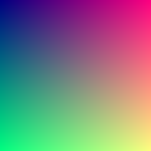

# compute-shaders
compute shaders duh

it compute

> In computer graphics, a shader is a computer program that calculates the appropriate levels of light, darkness, and color during the rendering of a 3D scene—a process known as shading. Shaders have evolved to perform a variety of specialized functions in computer graphics special effects and video post-processing, as well as general-purpose computing on graphics processing units.

Wikipedia is a little confused but they got the spirit.
